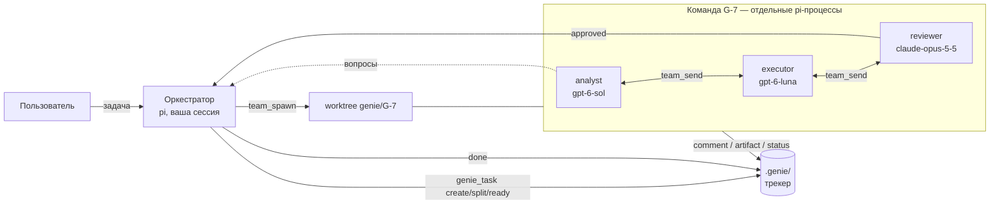

# Архитектура genie

> Архитектура TS-версии — расширения pi с локальным трекером, удалённого 2026-09-29. Нынешняя — сервер: [[platform/vision]], [[platform/backend]]; переход — [[platform/getting-started#Переход с расширения pi]].



## Компоненты

| Компонент | Путь | Назначение |
|---|---|---|
| Трекер | `src/tracker/` | Модель задачи, стейт-машина с правами ролей, DoR/DoD, хранилище SQLite (`db.ts`: `bun:sqlite` в pi, `node:sqlite` в Node), WAL + `BEGIN IMMEDIATE` для параллельных процессов |
| CLI | `bin/genie` → `src/cli/genie.ts` | Работа с трекером и командами из терминала (для вас и для любых агентов/харнесов) |
| Шина команды | `src/team/bus.ts` | Таблицы `teams`, `members` (статус, активность), `mail` (доставка ровно один раз в транзакции), `log` |
| Веб | `src/web/server.ts`, `web/` | HTTP API + SSE (`PRAGMA data_version`), React/TypeScript SPA (Vite): список, kanban (dnd-kit), карточка, чат команды |
| Уведомления | `src/notify.ts` | `notify-send` и herdr при переходе в `needs_owner`/`done` |
| Запуск | `src/team/spawn.ts` | git worktree на команду; участники в herdr (вкладка на команду, панель на участника) или headless (`pi --mode rpc`) |
| Конфиг и роли | `src/team/config.ts`, `config/default.json`, `agents/*.md` | Шаблоны команд, модели ролей по умолчанию, ролевые промпты (с переопределением) |
| Расширение pi | `src/extension/index.ts` | Роль сессии, инструменты, доставка почты, виджет, `/genie`, фильтр MCP по ролям |

## Жизненный цикл задачи

```
inbox → draft → refining → ready → in_progress → review ⇄ changes_requested
                                                    ↓
                                                approved → done
        (активный статус) ⇄ needs_owner      (любой) → cancelled
```

| Переход | Кто может |
|---|---|
| draft → refining | analyst, orchestrator |
| → ready | **только orchestrator** (проверка Definition of Ready: описание, критерии приёмки, существующие зависимости, не эпик) |
| ready / changes_requested → in_progress | executor (analyst — из ready); блокируется незакрытыми зависимостями |
| in_progress → review | executor (оркестратор — только с `force`) |
| review → approved / changes_requested | reviewer (оркестратор — только с `force`) |
| → done | **только orchestrator** (Definition of Done: все критерии отмечены, статус `approved`; для эпика — все дети закрыты) |
| → cancelled, → draft, → needs_owner | orchestrator (для `needs_owner` обязателен вопрос; хранится статус для возврата) |
| → inbox | только human |
| любой | human (вы через CLI) |

Права на поля: описание/критерии/зависимости — analyst и оркестратор; план — analyst и executor; заметки, комментарии, артефакты, блокировки — все; отметка критериев — reviewer и оркестратор. Участник команды может менять только свою задачу и её подзадачи; в эпик своей задачи он может добавлять комментарии и артефакты.

## Эпики

Эпик — крупная веха (`type: epic`): цель (описание), критерии успеха (критерии приёмки), дорожная карта (план), задачи эпика (дети через `parent`) и **общие артефакты** — требования, глоссарии, решения, тестовые данные, нужные всем задачам эпика.

- Оркестратор заводит эпик для большой работы, уточняет его с владельцем (при необходимости — командой аналитиков), кладёт общие материалы в эпик и создаёт задачи с `parent: <эпик>`. `split` задачи внутри эпика создаёт части в том же эпике, а саму задачу отменяет.
- Эпики не вкладываются друг в друга и не отдаются командам (DoR запрещает `ready` для эпика).
- `genie_task show` / `genie show` задачи эпика выводит цель эпика и список его общих артефактов; kickoff команды тоже напоминает о них. Участники читают их через `artifact_read` с id эпика.
- Эпик сам переходит в `in_progress`, когда команда начинает любую его задачу. Когда все задачи закрыты, оркестратор получает письмо: проверить критерии успеха и закрыть эпик (`done` — DoD требует закрытых детей и отмеченных критериев) или добавить недостающие задачи.
- В промпт оркестратора попадает список открытых эпиков с прогрессом; `genie_task epics` / `genie epics` показывают их отдельно.
- Веб: раздел «Эпики» (карточки с целью и прогрессом по статусам задач), страница эпика (цель, критерии, задачи, дорожная карта, общие артефакты с загрузкой из браузера), чип эпика на задачах, фильтр списка и доски по эпику, выбор эпика в карточке задачи и при создании. В обычных списках эпики видны только во «Входящих» и «Нужно решение».

## Где лежат данные

```
<main-worktree>/.genie/            (добавляется в .git/info/exclude — не коммитится)
  genie.db                          SQLite: meta, tasks, deps, acceptance, comments, artifacts (содержимое),
                                    history, teams, members, mail, log
  config.json, agents/<role>.md     переопределения для проекта (опц.)
  runtime/<team>/*.stderr.log       логи headless-участников
```

Агенты не читают `.genie/` напрямую: расширение блокирует `read`/`grep`/`bash` по пути трекера — содержимое задач попадает в контекст только по запросу через `genie_task` или CLI `genie`.

Трекер один на репозиторий: участники в worktree получают `GENIE_DIR`, без него `.genie/` находится в главном worktree через `git rev-parse --git-common-dir`.

## Общение

- Любой участник пишет любому (`team_send`), а также `orchestrator` и `all`.
- У каждого письма есть уровень `low` | `normal` | `high` (`urgent: true` — алиас `high`, без уровня — `normal`) и необязательный интент `question` | `blocker` | `verdict` | `done` | `fyi`.
- Доставка pull в момент чтения: пока получатель занят, письма остаются непрочитанными в БД (переживают падение и не теряются), и при освобождении (`agent_end` или ближайший тик, когда сессия idle) один `receive` забирает весь срез и отдаёт его одним сообщением. Пока процесс занят, забирается только `high`-письмо и уходит как steer; `low` и `normal` шаг не прерывают. Ровно одна доставка и порядок по `id` сохраняются. `low` и `normal` различаются только меткой уровня/интента и местом в дайджесте: оба ждут, пока получатель освободится, — отдельного режима доставки у `low` нет (решение владельца, 2026-09-27).
- Оркестратору накопленный срез показывается дайджестом: письма сгруппированы по командам, на отправителя оставлено только последнее письмо, впереди идут вопросы/блокеры команд, которые стоят и ждут ответа, затем вердикты/«готово», в конце — `fyi` одной секцией. Уровень и интент видны в сообщении агента; в веб-почте команды важные письма и прерывания помечены, интент — меткой («вопрос», «блокер»).
- Схема трекера: `SCHEMA_VERSION = 3` — у таблицы `mail` появились колонки `level` (по умолчанию `normal`) и `intent`; старые письма остаются валидными (`normal`, без интента).
- Действия владельца (новая задача во входящих, комментарий, смена статуса в вебе/CLI) пишутся в глобальный ящик оркестратора.
- LLM оркестратора в пересылке не участвует; оркестратор получает только адресованные ему письма.
- Человек может написать команде из терминала: `genie send G-7 executor "…"` (флаги `--level low|normal|high`, `--intent …`, устаревший `--urgent`) — или напрямую в панели herdr.

## Запуск участников

- **herdr** (по умолчанию внутри herdr): новая вкладка `genie <team>`, панель на участника, `herdr agent start <team>-<member> --kind pi -- <pi args>`. Можно зайти в панель и поговорить с агентом.
- **headless**: `pi --mode rpc` дочерним процессом оркестратора; команда живёт, пока жива сессия оркестратора.
- Аргументы участника: `--model`, `--thinking`, `--exclude-tools edit,write` для read-only ролей, `--name <team>:<member>`, окружение `GENIE_*`.

## Надёжность команд

- **Запуск не блокирует оркестратора.** `team_spawn` ждёт только создания вкладки/панелей herdr (секунды); `pi` в панелях запускают отдельные процессы `herdr agent start`, headless-участники — самостоятельные процессы в своей группе (stdin из FIFO, поэтому RPC-режим не завершается). Оркестратор сразу заканчивает ход и узнаёт о команде только из писем.
- **Участники не зависят от процесса оркестратора.** `/reload`, перезапуск или падение оркестратора их не останавливают; письма копятся в базе и доставляются новому оркестратору.
- **Пульс.** Каждый участник раз в 5 с пишет `heartbeat_at` и свой pid. Надзор в оркестраторе (раз в 10 с) помечает участника `lost`, если он не отметился за 150 с после запуска или молчит дольше 60 с и его процесса нет, и шлёт оркестратору срочное письмо.
- **Восстановление.** `team_recover` (или `/genie recover [team] [--no-restart]`) ищет процессы участников (`/proc`: метка `--name <team>:<member>` + тот же `GENIE_DIR`), переподключает живых, оживляет команды, ошибочно помеченные остановленными, и перезапускает потерянных с `--session <их файл сессии>` — разговор продолжается с места обрыва, им приходит письмо о перезапуске. При старте оркестратора то же выполняется автоматически без перезапуска.
- **Почта не теряется.** Оркестратору доставляются письма всех команд, кроме остановленных им намеренно (`stop_reason = orchestrator`).
- Оркестратору запрещено ждать команду через `sleep` в bash.
- **Команды закрытых задач останавливаются сами.** Если задача ушла в `done`/`cancelled` любым путём (оркестратор, веб-доска, CLI), её команда останавливается (`stop_reason = task_closed`, worktree сохраняется): сразу после смены статуса в вебе, раз в 20 с в `genie web` и в надзоре оркестратора.
- **Ручное управление** (`src/team/ops.ts`, общее для pi, CLI и веба): добавить участника (имя, модель, указания; запускается рядом с панелями команды в herdr или headless), убрать участника (процесс останавливается, команде приходит сообщение), остановить команду, удалить команду вместе с чатом и журналом. Остановки владельцем, оркестратором или по закрытию задачи считаются намеренными: такие команды не «оживают» и их запоздалые письма не будят оркестратора.
- Проверка: `node scripts/e2e-recovery.ts` — падение оркестратора (SIGKILL), убитый ревьюер, переподключение, `team_recover`, приёмка.

## Сбои моделей

Если запрос модели участника завершился ошибкой (провайдер недоступен, модель не поддерживается аккаунтом и т. п.), участник пишет `agent_error` в журнал команды, ставит статус `ERROR: …` и шлёт срочное письмо оркестратору (не чаще раза в минуту). Без этого headless-участник просто «молчал» бы.

## Ограничения MVP

- Фильтр MCP по ролям — защитное расширение: оно проверяет каждый вызов `mcp__<подключение>__<инструмент>` (и из скриптов `codemode`) по выдаче роли; остальное закрыто конфигом, который агент получает (см. [[platform/agent-roles-and-teams]]). Он мягкий: shell-агент может обойти защитное расширение, жёсткую границу даёт песочница.
- Веб без аутентификации: слушает 127.0.0.1 (и адрес tailnet с `--tailscale`), защищён allowlist'ом Host и заголовком на запись; автор комментариев из tailnet — через `tailscale whois`.
- Слияние веток команд — вручную (оркестратор сообщает ветку); автоматический merge/PR не реализован.
- Headless-команды не переживают выход оркестратора (herdr-команды переживают; их сессии можно продолжить).
- Права ролей — «мягкие»: агент с bash теоретически может поменять `GENIE_ROLE`; это защита от ошибок процесса, не от злоумышленника.
