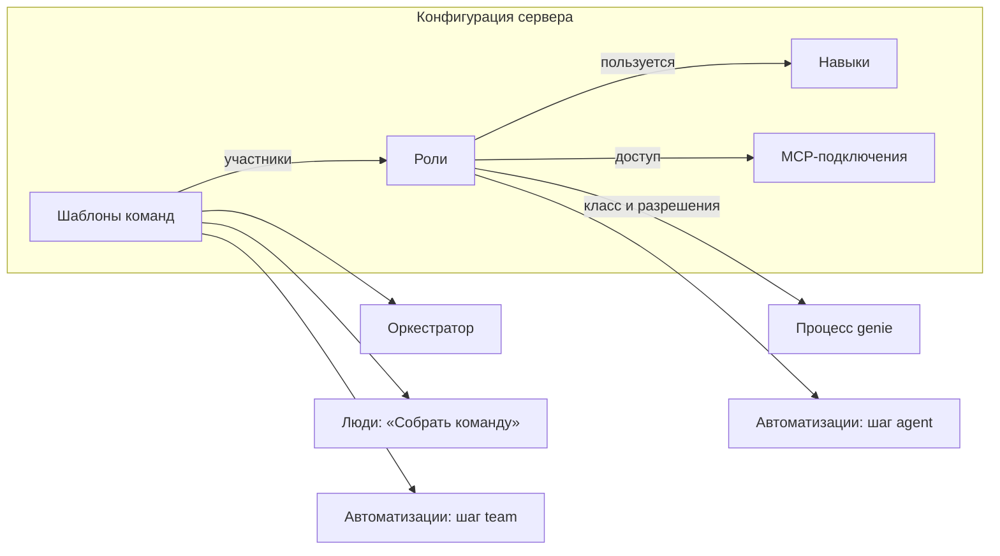
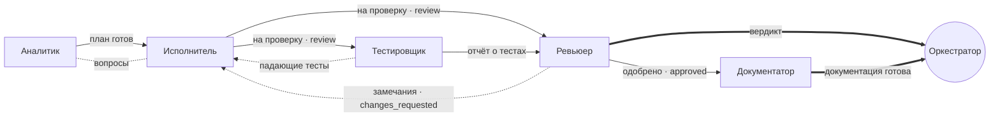

# Роли агентов и шаблоны команд

Контекст — [[platform/vision]], рантайм агентов — [[platform/backend]] и [[platform/agent-bus]] (живые сессии и почта), автоматизации — [[platform/automations]]. Решения владельца — PD13–PD16 в [[platform/decisions]].

## Что нужно

Запрос владельца (2026-09-28):

1. Заводить роли под проект.
2. Заводить шаблоны команд.
3. Указывать ролям навыки (skills), которыми они пользуются.
4. Выдавать ролям разные разрешения.
5. Выдавать ролям доступ к разным MCP-серверам.
6. Задавать в шаблоне команды связи между ролями.
7. Настраивать всё это файлами или визуально в вебе, одно и то же двумя способами.
8. Делать настройки общими: созданный шаблон видят все и могут использовать в своих задачах и автоматизациях.

Как владелец видит это устройство: genie поставляется с настройкой по умолчанию — ролями и пресетами команд. Тот, кто разворачивает сервер, настраивает роли и команды под свой контекст: добавляет им навыки, MCP-серверы и разрешения.

## Как сейчас и что мешает

| Что | Как устроено | Чем мешает |
|---|---|---|
| Роли | Enum из пяти ролей команды в коде (`Role` в `genie-core/src/model.rs`), промпты `agents/*.md` вшиты в бинарь; переопределение — только целым файлом `<data>/agents/<роль>.md` | Новую роль не завести; роль «под проект» — тем более |
| Модели | `roleModels` в конфиге сервера | Модель — единственное, что настраивается у роли |
| Шаблоны | `teams` в `config/default.json` и `<data>/config.json` | Правятся только файлом на машине сервера, в вебе не видны; оркестратору список зашит в промпт (`--template standard\|pair\|…`) |
| Связи | Зашиты в код kickoff по названиям ролей (`runtime.rs`, `kickoff`) и в тексты промптов («передай исполнителю») | Шаблон, не похожий на встроенные, получает неверные инструкции. Пример — `spike` (аналитик + ревьюер на готовой задаче): аналитику велено «передать исполнителю», ревьюеру — «ждать исполнителя», которого нет; до `approved` задачу никто довести не может, оркестратор закрывает её через `force` |
| Права | Переходы статусов и правка полей задачи — по ролям в коде (`model.rs`, `tracker.rs`); агент меняет только свою задачу; `excludeTools` из frontmatter → `--exclude-tools` у участников команд | Права нельзя настроить. У разовых заданий инструменты не ограничиваются вовсе, а `workspace: read-only` и `worktree` запускают агента в основной рабочей копии репозитория |
| MCP | `mcp:` во frontmatter учитывает только TS-расширение pi (фильтр инструмента `mcp` из pi-mcp-adapter) | Агенты на сервере (живые сессии и ходы) запускаются с `GENIE_ROLE=off`, так что при установленном pi-mcp-adapter любой агент получает все MCP-серверы, настроенные на машине. (Сейчас закрыто: см. «Выдача роли и доставка».) |
| Навыки | Понятия нет | pi подхватывает все установленные навыки для всех ролей |

## Принципы

1. **Роль — граница безопасности и поведения, шаблон — композиция.** Всё, что расширяет возможности агента (разрешения, MCP, навыки, инструменты), живёт только в роли. Шаблон собирает роли в команду и задаёт связи; расширить права участника он не может.
2. **Процесс не настраивается, настраиваются роли.** Статусы, DoR/DoD и шаги, доступные только оркестратору, остаются зашитыми (см. «Что сознательно не делаем» в [[platform/vision]]). Роль выбирает разрешения из фиксированного каталога.
3. **Настройка агентов — часть конфигурации сервера.** Её делает администратор под контекст своей команды; встроенные роли и пресеты — стартовая точка, а не жёсткий набор.
4. **Файл — источник правды, веб — редактор файла.** Всё, что настроено в вебе, лежит файлом в каталоге данных; всё, что лежит файлом, видно и правится в вебе. Сервер проверяет файлы при сохранении и при загрузке.
5. **Жёстко там, где можно, и честно там, где нельзя.** Что проверяет сервер (трекер, знания, почта, токены), то жёстко. Что держится только на флагах и расширениях харнесса (запрет записи файлов при доступном bash, фильтр MCP), в интерфейсе помечено «мягко» до контейнеров (Ф7).
6. **Без регресса.** Встроенные роли и шаблоны после переноса ведут себя как сейчас, кроме исправленных ошибок; старые настройки подхватываются автоматически.

## Понятия

| Понятие | Что это |
|---|---|
| **Роль агента** | Кто агент и что ему можно: промпт, класс, модель, навыки, разрешения, инструменты, MCP. Не путать с **ролью человека в проекте** (viewer, member, admin, owner) — это права людей, они не меняются |
| **Класс роли** | Одна из встроенных ролей процесса: `analyst`, `executor`, `reviewer`, `tester`, `documenter`. Задаёт набор разрешений по умолчанию, пул имён и то, как роль выглядит в истории задачи. Оркестратор — отдельный класс, одна роль на сервер |
| **Шаблон команды** (пресет) | Состав команды (участники — роли), связи между участниками, общие правила команды, стадия задачи и рабочее место |
| **Связь** | Кто кому передаёт работу, кто кому возвращает на доработку, кто докладывает оркестратору, кого можно спрашивать |
| **Навык** | Каталог по стандарту Agent Skills: `SKILL.md` с инструкциями, при необходимости скрипты и справочные файлы |
| **MCP-подключение** | Описание MCP-сервера: команда или URL, переменные окружения, проекты, где его можно выдавать ролям |
| **Разрешение** | Право из фиксированного каталога genie (например, `status.approve` — одобрить работу) |



## Где живёт настройка

Рядом с `config.json` в каталоге данных сервера:

```
<data>/
  config.json              как сейчас: порт, каналы, runtime, roleModels…
  agents/<id>.md           роли: промпт, настройки во frontmatter
  teams/<id>.json          шаблоны команд
  skills/<имя>/SKILL.md    навыки
  mcp.json                 MCP-подключения (формат mcpServers)
```

- **По умолчанию.** В бинарь вшиты встроенные роли (`agents/*.md` репозитория genie) и пресеты команд (`teams` в `config/default.json`) — со связями, повторяющими нынешнее поведение.
- **Переопределение.** Файл роли или шаблона с идентификатором встроенного переопределяет его. У роли незаданные поля берутся из встроенной: непустое тело заменяет промпт, `instructions` дописываются к нему, пустое тело оставляет встроенный промпт. Сменить исполнителю модель и добавить навык — файл из трёх строк. Шаблон заменяется целиком. «Вернуть по умолчанию» в вебе удаляет файл.
- **Новое.** Файл с новым идентификатором (`[a-z][a-z0-9-]*`) добавляет роль или шаблон. Роль может взять за основу другую: `extends: reviewer` — незаданные поля, промпт и разрешения берутся у неё.
- **Роли и шаблоны под проект.** Поле `projects: [erp]` ограничивает, где роль, шаблон или MCP-подключение доступны. Без него — во всех проектах.
- **Старые настройки** работают как раньше: нынешние `<data>/agents/<роль>.md` — это переопределения встроенных ролей, `teams` в `<data>/config.json` — шаблоны сервера (файл в `teams/` с тем же идентификатором главнее), `roleModels` — модели ролей по умолчанию.
- **Без перезапуска.** Сервер следит за файлами и подхватывает изменения. Невалидный файл не ломает работу: действует последняя валидная версия, ошибка видна в вебе и в `genie agents check`.

### Кто правит

Роли, шаблоны, навыки и MCP-подключения создают и правят **администраторы сервера** — файлами или в вебе. Остальные видят каталог (роли, шаблоны, навыки; у MCP — только названия и описания) и пользуются шаблонами в своих задачах и автоматизациях.

Каждая правка из веба записывается в журнал сервера: кто, когда, что было и что стало. В вебе у каждого элемента есть история и «вернуть эту версию». Сохранение сверяется с версией, открытой в редакторе, поэтому одновременная правка другого администратора или ручная правка файла не затирается — пользователь видит конфликт.

## Роль

### Файл роли

Markdown с frontmatter, как `agents/*.md` сейчас и как субагенты Claude Code: frontmatter — настройки, тело — промпт. Frontmatter плоский (значения и списки), поэтому его понимают и Obsidian, и простые парсеры.

```markdown
---
title: Ревьюер безопасности
description: Независимо проверяет изменение на уязвимости (OWASP Top 10, секреты, права доступа) и выносит вердикт. Звать для изменений в авторизации, платежах и работе с персональными данными.
base: reviewer
model: litellm/claude-opus-5-5
thinking: high
names: [argus, heimdall, cerberus]
deny: [task.check]
files: read
denyCommands: ["git push*", "git reset --hard*"]
skills: [owasp-review, secrets-scan]
mcp: [semgrep, "github:get_*", "github:list_commits"]
projects: [shop, erp]
---

You are the **security reviewer** of a focus team. You verify, you do not implement.
Before any verdict on configs, CI or .env changes, run the secrets-scan skill.
…
```

| Поле | Значение |
|---|---|
| `title` | Название для людей (в вебе, в уведомлениях) |
| `description` | Когда звать эту роль. Оркестратор выбирает роли и шаблоны по описаниям, поэтому описание — это инструкция для него |
| `base` | Класс роли. Обязателен для новой роли, если нет `extends` |
| `extends` | Роль-основа |
| `model`, `thinking` | Модель и уровень рассуждений по умолчанию |
| `names` | Пул шуточных имён; по умолчанию — пул класса |
| `allow`, `deny` | Разрешения сверх набора класса и изъятые из него (см. «Разрешения»); итоговый набор веб показывает целиком |
| `files` | `write`, `read` или `none` |
| `git` | Что роль может в репозиториях проекта самое большее: `none`, `read`, `write`. Без поля — как `files` (`write` → запись, `read` → чтение, `none` → нет доступа); поле только сужает, `git: write` при `files: read` записи не даёт. Что именно можно записать, решает политика репозитория и задача ([[platform/git-repositories]]) |
| `denyCommands` | Шаблоны команд shell, которые роли запрещены |
| `skills` | Навыки роли. Когда каким пользоваться, пишется в промпте роли |
| `mcp` | Доступ к MCP-подключениям: `сервер` — все его инструменты, `сервер:шаблон` — только подходящие инструменты |
| `stages` | На каких стадиях задачи роль может работать: `refinement` (до `ready`), `delivery`; по умолчанию — как у класса |
| `projects` | Где роль доступна; по умолчанию — везде |
| `instructions` | Текст, который дописывается к промпту, — удобно в переопределении встроенной роли |

Устаревшие поля по-прежнему читаются: `excludeTools: edit, write` означает `files: read`, `mcp: *` — все подключения, доступные проекту.

### Классы и то, что они задают

| Класс | Разрешения по умолчанию (сверх общих) | Файлы | Стадии | Пул имён |
|---|---|---|---|---|
| analyst | `status.refine`, `status.start`, `task.scope`, `task.plan`, `task.create` | read | refinement, delivery | детективы |
| executor | `status.start`, `status.rework`, `status.submit`, `task.plan` | write | delivery | роботы |
| reviewer | `status.approve`, `status.return`, `task.check` | read | refinement, delivery | мудрецы |
| tester | `status.return` | write | delivery | хаос |
| documenter | — | write | refinement, delivery | писатели |
| orchestrator | разбор, готовность, решения владельца, приёмка, нарезка, сбор команд и заданий, прерывание и пауза агентов — другим ролям не выдаются | write | — | — |

Общие разрешения всех классов: `task.block`, `docs.read`, `docs.write`, `mail.team`, `mail.orchestrator`, `team.peek`. Вместе с таблицей это ровно нынешнее поведение: переходы из `model.rs`, проверки полей задачи в `tracker.rs`, `excludeTools` из `agents/*.md`.

### Как собирается промпт агента

1. Тело роли (с учётом переопределения и `extends`), затем `instructions`.
2. Раздел «Как ты действуешь в genie» — таблица команд из каталога операций (`genie task …`, `genie mail …`, [[platform/backend#Каталог операций: MCP и CLI из одного описания]]), **только разрешённых роли**: операция попадает в таблицу, если её разрешает класс агента и хотя бы одно из разрешений роли, а в строке — только аргументы, которые роль может использовать (у исполнителя в `genie task update` есть `--plan`, но нет `--title`; у ревьюера в `genie task status` — «your role may set: changes_requested, approved»). Первый столбец — имя операции так, как его пишут тексты ролей и MCP-сервер (`genie_task` show, `genie_mail` send…), последний — что делает команда.
3. Проект и языковая политика; для ролей с `docs.read` — перечень страниц знаний проекта (L0, [[platform/knowledge-vault#Что агенты знают без запроса]]).
4. «Твоя команда» — из связей шаблона (см. ниже) и общих правил команды; kickoff участника заканчивается страницами знаний, подобранными для задачи (L1).
5. «Твои навыки» — имя и описание каждого навыка роли.
6. «MCP» — выданные подключения и их назначение.
7. Инструкции участнику из шаблона или от того, кто его добавил.

Промпт и флаги харнесса (модель, инструменты, навыки, MCP) агент получает при старте: участник команды и оркестратор — при запуске живой сессии ([[platform/agent-bus]]), разовое задание — на каждый ход.

## Разрешения

### Каталог

| Группа | Разрешение | Что даёт |
|---|---|---|
| Статусы | `status.refine` | draft → refining |
| | `status.start` | ready → in_progress |
| | `status.rework` | changes_requested → in_progress |
| | `status.submit` | in_progress → review |
| | `status.approve` | review → approved |
| | `status.return` | review → changes_requested |
| Задача | `task.scope` | Название, тип, описание, критерии приёмки, зависимости, эпик |
| | `task.plan` | План реализации |
| | `task.check` | Отмечать критерии приёмки |
| | `task.create` | Создавать подзадачи своей задачи |
| | `task.block` | `block` и `unblock` |
| Знания | `docs.read` | Поиск и чтение vault |
| | `docs.write` | Запись страниц; политика раздела по-прежнему решает, прямая это правка или предложение |
| Общение | `mail.team` | Письма и вопросы с ожиданием ответа участникам команды (`send`, `ask`); в режиме `flow` — только по связям шаблона |
| | `mail.orchestrator` | Письма оркестратору в обход «голоса команды» — вопросы и блокеры |
| | `team.peek` | Смотреть, чем занят сосед по команде (`peek`) |
| Люди (позже) | `people.ask` | Задать вопрос человеку опросником — как шаг `ask` автоматизаций |

Комментарии, артефакты, заметки, метки и строка статуса в карточке команды доступны всем ролям всегда: без них агент не может отчитаться о работе.

Роль берёт набор своего класса и правит его через `allow` и `deny`. Примеры: тестировщик с `task.check` отмечает критерии, которые подтвердил тестами; `researcher` — аналитик с `status.submit`, который сдаёт выводы на ревью.

### Что не настраивается

- Переходы в `draft`, `ready`, `needs_owner`, `done`, `cancelled` делает только оркестратор или человек; выдать их роли команды нельзя. Так же только им доступны нарезка задач (`split`), приоритет, стратегия интеграции и исполнители, а ещё прерывание агентов (`interrupt`) и пауза.
- Агент меняет только свою задачу и её подзадачи и оставляет заметки в эпике.
- DoR и DoD проверяются как сейчас.
- **Новое правило — разделение обязанностей:** участник, сдавший работу на ревью, не может сам же её одобрить в этом раунде. Сейчас это гарантируют классы, а с настраиваемыми разрешениями нужен явный запрет.

### Рабочее место и инструменты

| Настройка | Как применяется | Сила |
|---|---|---|
| `files: read` | pi: `--exclude-tools edit,write`, и защитное расширение не пропускает их вызовы; другие харнессы — их аналоги | Мягкая: через bash агент может записать файл |
| `files: none` | Рабочий каталог — пустой каталог агента (`<data>/workspaces/<проект>/…`), без инструментов записи | Мягкая |
| `denyCommands` | pi: защитное расширение genie (событие `tool_call`). Шаблон (`*` — любой текст) сверяется с каждой простой командой строки shell: после `&&`, `;`, `\|`, внутри `$(…)` и кавычек (`bash -c '…'`), без присваиваний и обёрток вроде `sudo` и `env`. Claude Code — `--disallowedTools` | Мягкая |
| `workspace` шаблона | Каталог, в котором работает команда (см. «Шаблон команды») | Жёсткая по каталогу, мягкая по записи |

Жёсткая изоляция файлов (read-only монтирование, отдельный пользователь ОС, контейнер на команду) — вместе с контейнерами в Ф7. До тех пор веб помечает «мягкие» ограничения как соблюдаемые харнессом.

Правила защитного расширения (`denyCommands`, доступ к MCP, `files`) лежат в файле агента. Сервер переписывает его при изменении конфигурации, так что отзыв действует на работающего агента со следующего вызова инструмента; навыки и набор MCP-подключений меняются со следующего старта его сессии.

Разовые задания получают инструменты своей роли, а `workspace` задания соблюдается: `read-only` — репозиторий без инструментов записи; `worktree` — свой worktree `job-<id>` на ветке `genie/job-<id>`, общий для повторных попыток и остающийся после задания; `scratch` и `none` — пустой каталог задания. Задание, которое не удалось запустить (роль удалена, worktree не создался), считается неуспешной попыткой, а не висит в работе.

### Где проверяется

| Что | Где | Сила |
|---|---|---|
| Разрешения на задачи, знания, почту, сбор команд | Сервер, по токену агента | Жёсткая |
| MCP | Шлюз genie: сервер по токену агента проверяет выдачу роли при каждом запросе, держит секреты у себя и пишет вызовы в журнал; защитное расширение отсекает чужие вызовы ещё в харнессе | Жёсткая для подключений через шлюз; мягкая для `"gateway": false` (конфиг с секретами у харнесса) |
| Навыки | Флаги харнесса (`--no-skills` + `--skill`) | Мягкая: это инструкции, а не доступ |
| Файлы и команды shell | Флаги и расширение харнесса | Мягкая до Ф7 |

Токен агента (живой сессии или хода задания) получает идентификатор роли, а не только класс. Сервер находит роль в конфигурации при каждом запросе, так что отзыв разрешения действует сразу, даже для уже работающей команды.

## Навыки

- Формат — [Agent Skills](https://agentskills.io/specification): каталог с `SKILL.md` (`name`, `description`) и сопутствующими файлами. Его понимают pi и Claude Code, готовые наборы (например, `anthropics/skills`, `badlogic/pi-skills`) подключаются как есть.
- Где лежат: `<data>/skills/` и каталоги из `skills.paths` в `config.json` — например, клон репозитория с навыками. Администратор добавляет навык файлами или в вебе (редактор `SKILL.md`, загрузка файлов).
- Роль перечисляет навыки по имени; когда каким пользоваться, говорит её промпт.
- Навыки репозитория проекта (`.agents/skills`, `.pi/skills`) — часть кода проекта: агент получает их всегда.
- Доставка в харнесс: pi — `--no-skills` и `--skill <каталог>` для каждого навыка роли, затем `--skill` для каталогов навыков репозитория (`.pi/skills` и `.agents/skills` до корня репозитория). Навыки репозитория передаются явно, потому что в безголовом режиме pi загружает их, только если проект отмечен доверенным. Другие харнессы — через свой адаптер.
- Если в роли нет поля `skills`, `--no-skills` не передаётся: агент получает навыки, установленные для pi, и навыки репозитория; `skills: []` — только навыки репозитория. Навык роли, которого нет в библиотеке, пропускается, `genie agents check` об этом предупреждает.

## MCP-подключения

### Где описаны

`<data>/mcp.json` в том же формате `mcpServers`, что `.mcp.json` у Claude Code и `mcp.json` pi (существующие настройки можно вставить как есть), плюс поля genie:

```json
{
  "mcpServers": {
    "sap-dev": {
      "description": "SAP DEV через ADT, только чтение",
      "command": "npx",
      "args": ["-y", "@mcp-abap-adt/core"],
      "env": { "SAP_URL": "https://sap-dev.example:44300", "SAP_USER": "${env:SAP_DEV_USER}", "SAP_PASSWORD": "${env:SAP_DEV_PASSWORD}" },
      "projects": ["erp"]
    },
    "github": {
      "type": "http",
      "url": "https://api.githubcopilot.com/mcp/",
      "headers": { "Authorization": "Bearer ${env:GITHUB_MCP_TOKEN}" }
    }
  }
}
```

- **Секреты** в файл не пишутся: `${env:ИМЯ}` берётся из окружения сервера.
- `projects` — где подключение можно выдавать ролям; без него — во всех проектах.
- `gateway` — `false` отдаёт подключение харнессу напрямую, в обход шлюза (см. ниже); по умолчанию `true`.
- `exposure` и `toolExposure` — как инструменты подключения попадают к модели, поля `mcp.json` pi (`direct`, `deferred`, `codemode`, `hidden`; см. ниже). Без них genie выбирает сам.
- Имя подключения — буквы, цифры, `_` и `-`; имена, различающиеся только `-` и `_`, pi считает одним сервером, `genie agents check` их не пропустит. Инструменты называются `mcp__<подключение>__<инструмент>` (`-` и прочие символы становятся `_`).
- В вебе: список подключений, как агенты до них доходят (через genie или напрямую), «Проверить» (запуск и список инструментов с ролями, которым каждый доступен, а при сбое — что написал сервер), какие роли имеют доступ, журнал вызовов проекта.

### Выдача роли и доставка

Роль перечисляет подключения и, при желании, инструменты (`mcp: [sap-dev, "github:get_*"]`).

- **Через шлюз genie (по умолчанию).** Агент ходит в MCP через сервер: `POST /api/mcp-gateway/<подключение>` (MCP Streamable HTTP, ответы JSON) со своим токеном. При каждом запросе сервер находит роль агента в текущей конфигурации и проверяет выдачу, так что отзыв подключения или инструмента действует сразу. Сервер сам подключается к настоящему серверу — запускает процесс в рабочем каталоге агента или ходит по HTTP — с секретами из своего окружения; в списке инструментов агент видит только выданные, вызов другого получает отказ. Ресурсы и промпты сервера доступны роли, которой выдано всё подключение. Запросы сервера к клиенту (sampling, roots, elicitation) отклоняются. Одно соединение на агента и подключение; неиспользуемое закрывается через 10 минут, остановившийся сервер перезапускается при следующем запросе.
- **Журнал.** Каждый вызов инструмента через шлюз — событие `mcp.called` в журнале проекта: кто (агент, его роль, команда или задание), какой инструмент, итог (успех, ошибка инструмента, отказ), время и аргументы (усечённые). Веб показывает эти вызовы на вкладке MCP; правила автоматизаций могут на них реагировать.
- **Конфиг при старте агента.** Рантайм пишет в каталог агента (`<data>/runtime/<проект>/<агент>/mcp.json`, файл доступен только владельцу) конфиг только из выданных роли подключений, в формате `mcp.json` pi, и передаёт его путь в `GENIE_MCP_CONFIG`. Для подключения через шлюз в нём только адрес шлюза и заголовок `Authorization: Bearer ${GENIE_TOKEN}` — pi подставляет токен агента из окружения, секретов в файле нет. Переменные окружения, на которые ссылаются такие подключения, из окружения агентов убраны (кроме общих вроде `HOME` и `PATH` и тех, что нужны подключениям без шлюза). Для подключения с `"gateway": false` — сама запись: значения `${env:…}` подставлены, поля genie убраны. Claude Code — `--mcp-config` вместе с `--strict-mcp-config`.
- **Встроенный MCP pi, а не адаптер.** pi 1.0 умеет MCP сам (`mcp__<подключение>__<инструмент>`, `codemode`, `tool_search`), а `pi-mcp-adapter` подменяет эту поддержку и на pi 1.0 не работает. У нативной поддержки нет флага `--mcp-config`: она читает `~/.pi/agent/mcp.json` (пользователь сервера) и `.pi/mcp.json` репозитория (в доверенном проекте), а зарегистрированный расширением сервер уступает записи из файла с тем же именем. Чтобы агент видел только выданное роли, защитное расширение genie подменяет встроенное расширение MCP pi (расширение, которое регистрирует `/mcp`, его заменяет) экземпляром того же кода: `createMcpExtension` с загрузчиком, который не читает никаких файлов, и серверами роли из `GENIE_MCP_CONFIG`. Поэтому ни `mcp.json` пользователя, ни `.pi/mcp.json` репозитория до агента не доходят (тесты: пользовательский и репозиторный серверы вместе с сохранённым `/trust`), а состояние OAuth pi хранит в памяти процесса, не в `~/.pi/agent/mcp-auth.json`, и журнал `mcp.log` пишет в каталог агента. Отдельный `PI_CODING_AGENT_DIR` на агента отвергнут: в нём же `auth.json` (токены обновляются), `models.json`, настройки и `trust.json`. Агентам genie передаёт `--no-approve`: сохранённое `/trust` не подключит им `.pi/extensions`, `.pi/settings.json` и прочее из репозитория.
- **Как инструменты доходят до модели.** Роль, которой выдана часть инструментов (`github:get_*`), получает их объявленными (`direct`), остальные инструменты подключения скрыты (`hidden` для подключения, `toolExposure` с шаблонами выдачи): модель их не видит и вызвать не может. Роль, которой выдано подключение целиком, находит инструменты через `tool_search` (`deferred`): схемы сотен инструментов не лежат в каждом запросе, в системном промпте только строка подключения. Это умолчания: `exposure` у подключения в `mcp.json` их переопределяет (`direct` — всё объявлено, подходит малым серверам; `codemode` — скрипты на JavaScript вызывают инструменты параллельно и фильтруют большие ответы, модель сама пишет код; `hidden` — закрыто). `codemode` pi включает, только если админ выставил его у подключения, а не для всех ролей. Вызовы из скриптов `codemode` проходят через те же обработчики `tool_call`, что и прямые, и видны защитному расширению; инструменты, исключённые `--exclude-tools` (`edit`, `write` у `files: read`), в скриптах не существуют вовсе (`tools.write` — ошибка), а `denyCommands` действует и на `tools.bash` из скрипта.
- **Защитное расширение** проверяет каждый вызов (и прямой, и из скрипта `codemode`) по подключению и инструменту, под которыми pi его зарегистрировал, — не разбором имени. Чужое подключение, инструмент вне шаблонов выдачи, ресурсы подключения, выданного частично, и любой инструмент `mcp__…`, не зарегистрированный для роли, получают отказ. Закрыты и инструменты ещё установленного `pi-mcp-adapter`. Устанавливать серверы агенты не могут (`pi mcp add` в shell меняет `~/.pi/agent/mcp.json`, который агент не читает: его MCP — только из выданного конфига).
- **pi-mcp-adapter больше не нужен.** Если pi всё ещё его загружает (Docker-образ убирает его из настроек при старте), на pi 1.0 он подменяет встроенную поддержку, и `genie doctor`, `genie agents check`, страница «Агенты» и журнал сервера просят его убрать: `pi remove npm:pi-mcp-adapter`. Устаревшая настройка `runtime.mcpAdapter` читается и игнорируется.
- **Без шлюза** (`"gateway": false` у подключения или `"runtime": { "mcpGateway": false }` для всех): значения `${env:…}` оказываются в файле и окружении, которые агент может прочитать, выдачу проверяют только pi и защитное расширение, а вызовы не видны в журнале genie. Этот способ оставлен для подключений, которым нужен харнесс (например, вход через OAuth в браузере).
- **Проверка подключения** (`POST /api/mcp/<подключение>/check`, администраторы) запускает его так же, как шлюз, и возвращает список инструментов или ошибку вместе с последними строками, которые сервер написал в stderr.

## Шаблон команды

### Файл шаблона

JSON, как пресеты в `config.json` сейчас. Лежит в `<data>/teams/<id>.json`; ключ `teams` в `config.json` тоже читается.

```json
{
  "title": "Полная команда",
  "description": "Крупное изменение кода — аналитик, исполнитель, тестировщик и ревьюер; документатор подключается после одобрения.",
  "stage": "delivery",
  "workspace": "worktree",
  "mail": "open",
  "members": [
    { "role": "analyst" },
    { "role": "executor" },
    { "role": "tester" },
    { "role": "reviewer" },
    { "role": "documenter" }
  ],
  "relations": [
    { "from": "analyst", "to": "executor", "type": "handoff", "note": "план готов" },
    { "from": "executor", "to": ["tester", "reviewer"], "type": "handoff", "on": "review", "note": "работа сдана на проверку" },
    { "from": "tester", "to": "reviewer", "type": "handoff", "note": "отчёт о тестах" },
    { "from": "reviewer", "to": "executor", "type": "returns", "on": "changes_requested" },
    { "from": "tester", "to": "executor", "type": "returns" },
    { "from": "reviewer", "to": "documenter", "type": "handoff", "on": "approved", "note": "работа одобрена" },
    { "from": "reviewer", "to": "orchestrator", "type": "reports", "note": "вердикт" },
    { "from": "documenter", "to": "orchestrator", "type": "reports", "note": "документация готова" },
    { "from": "executor", "to": "analyst", "type": "consults" }
  ],
  "charter": "Commit small, verifiable steps. Every submission carries a test report."
}
```

| Поле | Значение |
|---|---|
| `title`, `description` | Для людей и для оркестратора: когда подходит этот шаблон |
| `stage` | `refinement` — задача до `ready` (исследование, уточнение), `delivery` — готовая задача. Роли участников должны допускать эту стадию; так обобщается нынешнее правило «до `ready` — только analyst, reviewer, documenter» |
| `workspace` | `worktree` — свой git-worktree; `repo` — основная рабочая копия; `scratch` — пустой каталог команды. В проекте без кода `worktree` и `repo` означают каталог команды, как сейчас. Старое `"worktree": true/false` читается как `worktree`/`repo` |
| `mail` | `open` — участники пишут кому угодно в команде, как сейчас; `flow` — только по связям, а оркестратору — только «голос команды» и вопросы или блокеры |
| `members` | Участники: `role`, при необходимости `key` (если две одинаковые роли, например `executor-api` и `executor-web`), `name`, `model`, `thinking`, `instructions` |
| `relations` | Связи между участниками (`from` и `to` — ключи участников или `orchestrator`) |
| `charter` | Общие правила команды — попадают в промпт каждого участника |
| `projects` | Где шаблон доступен; по умолчанию — везде |

### Связи

| Тип | Смысл | Что делает genie |
|---|---|---|
| `handoff` — передаёт работу | A закончил свой шаг и передаёт результат B | B после старта ждёт передачи (ставит статус ожидания и не пишет писем); A знает, кому и что передать |
| `returns` — возвращает на доработку | A может вернуть работу B с замечаниями | A знает, кому возвращать; B знает, от кого ждать замечаний |
| `reports` — докладывает | A — «голос команды» перед оркестратором | A отправляет итог (`intent: verdict` или `done`); в режиме `flow` остальные пишут оркестратору только вопросы и блокеры |
| `consults` — можно спрашивать | A задаёт вопросы B напрямую | В промпте A: «вопросы — к B» (`genie mail ask` ждёт ответа); в режиме `flow` разрешает вопросы и письма A → B и ответы |

- **`on: <статус>` — передача по статусу.** Такую связь исполняет сам genie: когда задача входит в статус, адресаты получают системное письмо с заметкой к смене статуса. Исполнителю достаточно перевести задачу в `review` с заметкой — ревьюер и тестировщик узнают об этом, даже если исполнитель забыл им написать. Связи без `on` исполняет агент по инструкции.
- **Старт участника** выводится из связей: без входящей передачи — начинает сразу, со входящей — ждёт её.
- **Проверки шаблона**:
  - ошибка — у участника нет способа начать (цикл ручных передач);
  - ошибка — стадия шаблона не подходит роли;
  - ошибка — связь ссылается на несуществующего участника;
  - предупреждение — никто не докладывает оркестратору;
  - предупреждение — в шаблоне `delivery` нет роли с `status.submit` или `status.approve` (задачу нельзя будет закрыть без `force`);
  - предупреждение — роль с записью файлов работает в `workspace: repo`, то есть в основной рабочей копии.



Сплошная стрелка — передача работы, пунктирная — возврат на доработку, жирная — доклад оркестратору, пунктир без стрелки — можно спрашивать.

### Что получает участник

Kickoff и раздел «Твоя команда» генерируются из связей, а не из названий ролей. Исполнитель в команде выше получит:

```
You are Bender, the executor of team G-7 (template "full").
Team: Sherlock — analyst, Murphy — tester, Gandalf — reviewer, Tolkien — documenter, plus the orchestrator.
How the team works:
- You start after Sherlock hands over (plan ready): set a waiting status and end your turn.
- When the work is ready, move the task to review with a note — genie passes it to Murphy and Gandalf.
- Gandalf and Murphy may return the work with findings: fix them and submit again.
- Ask Sherlock directly about the plan (`genie mail ask sherlock "…"`).
- Gandalf is the team's voice to the orchestrator; message the orchestrator yourself only with a scope question or a blocker.
```

Промпты встроенных ролей теряют упоминания конкретных коллег («передай исполнителю»): в промпте роли остаётся ремесло, в разделе команды — маршрут. Встроенные шаблоны получают связи, повторяющие нынешнее поведение. `spike` исправляется: в нём работает роль `researcher` (класс analyst плюс `status.submit`) со связями researcher → reviewer → оркестратор, и задача доходит до `approved` без `force`.

### Работающие команды

- **Структура фиксируется при запуске.** Команда хранит снимок: шаблон, участников, связи, общие правила. Правка шаблона не перестраивает идущие команды; на экране команды видно «шаблон изменён после запуска».
- **Разрешения действуют сразу.** Сервер проверяет их по конфигурации на каждом запросе: отозванное разрешение перестаёт работать немедленно, и в уже работающих командах тоже.
- **Промпт, модель, навыки и MCP — со следующего старта сессии.** Живая сессия получает их при запуске. Правка роли доходит до работающих участников, когда их сессия перезапустится: после простоя (`idleStopSecs`) или по кнопке «Перезапустить с новой ролью» на экране команды. Разговор при этом продолжается, меняются только настройки.

## Как этим пользуются

- **Оркестратор** получает в промпте каталог шаблонов и ролей проекта (идентификатор, описание, стадия, рабочее место). Он собирает команду по шаблону (`genie team spawn G-7 --template security-review`) или из ролей (`--member reviewer --member security-reviewer`), добавляет участника любой ролью (`genie team add-member G-7 sap-analyst`). Полный список — `genie team templates` и `genie team roles`.
- **Люди в задаче.** На карточке задачи есть кнопка «Собрать команду». Диалог показывает шаблоны, подходящие задаче: по стадии, наличию кода в проекте и `projects`. Для выбранного шаблона видны состав и граф связей; перед запуском можно поменять модели, убрать или добавить участника, оставить заметку.
- **Автоматизации.** Шаг `team` принимает любой шаблон (`"template": "security-review"`), шаг `agent` — любую роль (`"role": "sap-analyst"`); инструменты задания, навыки и MCP берутся из роли. Сохранение правила проверяет, что шаблон и роль существуют и доступны проекту. У шаблона и роли видно, какие правила их используют.
- **CLI:** `genie agents check` — проверить файлы настройки, `genie agents ls` — что получилось в итоге; `genie agents show|save|delete|history <элемент>` (`role:<id>`, `team:<id>`, `skill:<имя>[/<файл>]`, `mcp`) — то же, что редактор на странице «Агенты»: сервер проверяет файл перед записью и ведёт историю, `--base-hash` не даёт затереть чужую правку.

## Веб-интерфейс

В разделе «Команда и правила» появляется пункт «Агенты» с вкладками. Все видят каталог, администраторы сервера — ещё и редакторы.

**Роли.** Список: класс, модель, число навыков и MCP, проекты, в скольких шаблонах и автоматизациях используется, пометка «изменена относительно встроенной». Страница роли:

- «Промпт» — редактор Markdown с предпросмотром; встроенный текст виден отдельно;
- «Навыки» — выбор из установленных;
- «Разрешения» — флажки по группам каталога; набор класса отмечен, отличия подсвечены, неизменяемые права видны, но выключены;
- «Инструменты и MCP» — файлы, запрещённые команды, подключения и их инструменты; мягкие ограничения помечены;
- «Файл» — сам файл с подсветкой ошибок: правка здесь и в форме — одно и то же;
- «Где используется», «История», «Вернуть по умолчанию».

**Шаблоны команд.** Список: название, описание, аватары участников, стадия и рабочее место, проекты, в скольких автоматизациях используется; граф — на странице шаблона. Страница шаблона:

- участники — таблица: роль, ключ, имя, модель, инструкции;
- связи — таблица «кто → кому → тип → по статусу → заметка» и рядом живой граф. Таблица работает с клавиатуры и на телефоне, граф показывает маршрут и ошибки: участник, который не сможет начать, подсвечен. Связь можно протянуть мышью прямо на графе;
- общие правила команды;
- «Что получит каждый участник» — сгенерированные kickoff и промпт для выбранной задачи. Шаблон проверяется до запуска;
- «Файл», «Где используется», «История».

**Навыки** — список, просмотр и редактор `SKILL.md`, сопутствующие файлы (загрузка в папку, просмотр, удаление), какие роли пользуются.

**MCP-подключения** — список (через шлюз или напрямую), проверка подключения с инструментами и ролями, которым каждый доступен, доступность по проектам, журнал вызовов проекта.

Связанные экраны: «Собрать команду» на карточке задачи; экран команды показывает граф шаблона с живым состоянием участников (кто работает, кто ждёт передачи); редактор правил автоматизаций подсказывает шаблоны и роли.

## API

| Маршрут | Что делает |
|---|---|
| `GET /api/agent-config` | Каталог для текущего проекта: роли (без промптов), шаблоны, навыки, MCP (без `env` и заголовков), проблемы, каталог разрешений, наборы разрешений классов (`classes`), сколько автоматизаций называет каждый шаблон и роль (`automations`), признаки `admin`, `mcpAdapter` и `mcpGateway` |
| `GET/PUT/DELETE /api/roles/{id}` | Роль: итоговые настройки, файл и его хэш, встроенный текст, где используется. `PUT` принимает файл целиком (`content`) и `baseHash` |
| `GET/PUT/DELETE /api/templates/{id}` | Шаблон; `PUT` принимает текст (`content`) или JSON (`template`) |
| `POST /api/templates/{id}/preview` | Kickoff каждого участника для задачи (`{"task": "G-7"}`) или для примера |
| `GET/PUT/DELETE /api/skills/{name}` | Навык (`SKILL.md`) |
| `GET/PUT/DELETE /api/skills/{name}/files/{path}` | Сопутствующий файл навыка из каталога данных: `PUT` принимает содержимое как есть (до 5 МБ), путь относительный, без `..`; `GET` отдаёт текст или только размер двоичного файла |
| `GET/PUT /api/mcp` | MCP-подключения; файл целиком видят только администраторы |
| `POST /api/mcp/{id}/check` | Запустить подключение и получить его инструменты или причину сбоя (администраторы) |
| `GET /api/mcp/calls` | Последние вызовы инструментов через шлюз в проекте (`?limit=`), новые первыми; агентам недоступно |
| `POST /api/mcp-gateway/{id}` | Шлюз MCP для агентов: MCP Streamable HTTP с токеном агента; `GET` и `DELETE` — 405 (поток от сервера и сессии не нужны) |
| `GET /api/agent-config/history` | Журнал правок (`?item=role:qa`) |
| `POST /api/teams` | Как раньше, плюс участники из любых ролей (`members: [{"role": "qa"}]`) и модели участников шаблона по ключам (`models: {"reviewer": "…"}`) — связи шаблона при этом сохраняются |

Менять может только администратор сервера. Сохранение проверяет новую версию загрузчиком так, как он её прочитает, и отказывает, если она невалидна или ломает то, что работает сейчас (например, удаление роли, которую использует шаблон). Правка, начатая со старой версии файла (`baseHash` не совпал), получает конфликт.

## Совместимость и перенос

- Встроенные роли и шаблоны — `agents/*.md` и `config/teams/*.json` (бывшие `teams` из `config/default.json`) с добавленными классами и связями; поведение то же, кроме исправленного `spike`.
- `roleModels` из конфига продолжает работать как модель по умолчанию, если роль её не задаёт. Порядок: явное указание при запуске → участник шаблона → роль → `roleModels` → модель харнесса.
- Данные: `members.role` хранит идентификатор роли. Трекер по-прежнему пишет в историю, комментарии и артефакты класс роли. Токен агента получает поле `role_id`.
- Задания автоматизаций принимают любую роль вместо пяти фиксированных.
- MCP: раньше агенты pi видели все серверы из глобальных конфигов пользователя, от имени которого работает сервер; теперь — только выданные роли из `<data>/mcp.json`. Нужные серверы переносятся в `<data>/mcp.json` и выдаются ролям. При переходе на pi 1.0 вместо `pi-mcp-adapter` работает встроенная поддержка MCP pi: адаптер из настроек pi надо убрать (`pi remove npm:pi-mcp-adapter`), `--mcp-config {mcpConfig}` из своих команд — тоже.

## Этапы

Каждый этап даёт проверяемый результат.

**Статус (2026-09-28).** Р1–Р5 сделаны.

- Р1: конфигурация и её проверка, роли по идентификатору с классом и разрешениями на сервере, шаблоны со связями и передачами по статусу, kickoff из связей, каталог оркестратора, API и CLI.
- Р2: навыки роли и репозитория через флаги харнесса; MCP-конфиг только с выданными подключениями (сначала для pi-mcp-adapter, теперь для встроенного MCP pi); защитное расширение genie (`denyCommands`, фильтр MCP, запрет записи); правила работающих агентов обновляются при изменении конфигурации. Разовые задания работают в своём `workspace`, роль с `files: none` — в пустом каталоге.
- Заодно исправлено: первый запрос новой живой сессии уходил к модели без системного промпта, то есть без роли.
- Р3: страница «Агенты» (роли, шаблоны команд, навыки, MCP, история с откатом) — всем для просмотра, администраторам для правки: разрешения флажками, настройки, навыки и доступ к MCP роли, шаблон в форме с живым графом, файлы целиком, новые роли, шаблоны и навыки. Предпросмотр kickoff. «Собрать команду» в задаче — по шаблону (со своими моделями участников) или из ролей. Роли из конфигурации в «Добавить участника», подсказка шаблонов и ролей в редакторе правил.
- Р4: режим почты `flow` проверяет сервер — участник пишет только по связям шаблона, оркестратору без `reports` — только вопросы и блокеры, всем сразу — нельзя, ответы на вопросы проходят всегда; kickoff называет маршрут. На экране команды — схема: граф её снимка с живым состоянием участников, кто кого ждёт и какие передачи впереди; пометка «шаблон изменён после запуска» (команда хранит хэш шаблона, с которого стартовала); перезапуск участника с текущей ролью. В редакторе шаблона связь можно протянуть мышью от участника к участнику.
- Р5: шлюз MCP — агенты ходят в выданные подключения через сервер со своим токеном; сервер проверяет выдачу при каждом запросе, держит секреты у себя (переменные, на которые ссылаются подключения, убраны из окружения агентов), показывает агенту только выданные инструменты и пишет каждый вызов в журнал проекта (`mcp.called`). Проверка подключения из веба и журнал вызовов на вкладке MCP. Подключение с `"gateway": false` отдаётся харнессу как раньше.
- Веб после Р5: промпт роли — в редакторе с живым предпросмотром Markdown и встроенным текстом рядом; сопутствующие файлы навыка загружаются, открываются и удаляются в вебе; редактор файла нумерует строки и отмечает те, на которые указывают ошибки (загрузчик frontmatter называет строку в каждой своей ошибке).

| Этап | Что входит | Готово, когда |
|---|---|---|
| **Р1. Роли и шаблоны в конфигурации сервера** | Форматы и проверка; загрузка встроенного и файлов каталога данных, переопределения и `extends`, `projects`, подхват изменений без перезапуска; роли по идентификатору с классом; разрешения на сервере вместо таблиц по ролям и разделение обязанностей; шаблоны со связями и передачами по статусу; kickoff из связей; каталог для оркестратора; шаги `team` и `agent` по конфигурации; API чтения и записи для администратора; `genie agents check\|ls` | Администратор файлами заводит роль со своими разрешениями и шаблон со связями; их используют оркестратор и автоматизация; роль без `status.approve` получает отказ сервера; встроенные шаблоны дают прежние kickoff, `spike` доходит до `approved` без `force` |
| **Р2. Навыки и MCP в харнессе** | Навыки и доставка (`--no-skills`, `--skill`); MCP-конфиг при старте агента; защитное расширение pi (`denyCommands`, фильтр MCP); инструменты роли и `workspace` у разовых заданий | Агент видит навыки своей роли и только их; агент без доступа к подключению не может вызвать его инструменты; read-only роль не имеет edit и write |
| **Р3. Веб** | Вкладки «Агенты»: роли, шаблоны с графом, навыки, MCP — просмотр для всех, редактирование для администраторов; история и откат; «Собрать команду» в задаче; предпросмотр участника | Администратор в вебе заводит шаблон, участник другого проекта запускает по нему команду на своей задаче и в своей автоматизации |
| **Р4. Связи в работе** | Режим почты `flow`; живой граф на экране команды; протягивание связей на графе | Команда в режиме `flow` общается только по маршруту шаблона; видно на графе, кто кого ждёт |
| **Р5. Шлюз MCP** | MCP-эндпоинт genie с токеном агента, секреты на сервере, журнал вызовов | Вызовы MCP видны в журнале проекта, значения секретов не попадают к агенту |

## Решения и открытые вопросы

Решено владельцем 2026-09-28 ([[platform/decisions]]):

| № | Вопрос | Решение |
|---|---|---|
| PD13 | Где живёт настройка ролей и команд | В конфигурации сервера: встроенные роли и пресеты по умолчанию, администратор настраивает их под свой контекст — файлами в каталоге данных или в вебе |
| PD14 | Кто создаёт и правит роли, шаблоны, навыки, MCP | Только администраторы сервера; остальные видят и пользуются |
| PD15 | Модель ролей | Класс процесса плюс настройка разрешений (`allow`, `deny`) |
| PD16 | Доступ к MCP | Пока — MCP-конфиг харнессу при старте агента; шлюз genie — позже. Шлюз сделан в Р5 и стал способом по умолчанию; прежний остаётся для подключений с `"gateway": false` |

Открыто:

| № | Вопрос | Рекомендация |
|---|---|---|
| RQ6 | Достаточно ли «мягкого» запрета записи файлов до контейнеров (или нужна изоляция раньше: отдельный пользователь ОС, read-only монтирование) | Достаточно до Ф7, с пометкой в вебе. Частично сделано: песочница bubblewrap (PP11 в [[platform/decisions]]) не даёт агенту писать за пределами своего рабочего каталога и видеть данные сервера; внутри worktree `files: read` остаётся мягким |
| RQ7 | Люди в шаблонах: участник-человек (автор задачи, `@логин`), связи с ним — через уведомления и опросники | Позже, после Р3: механизм опросников уже есть |
