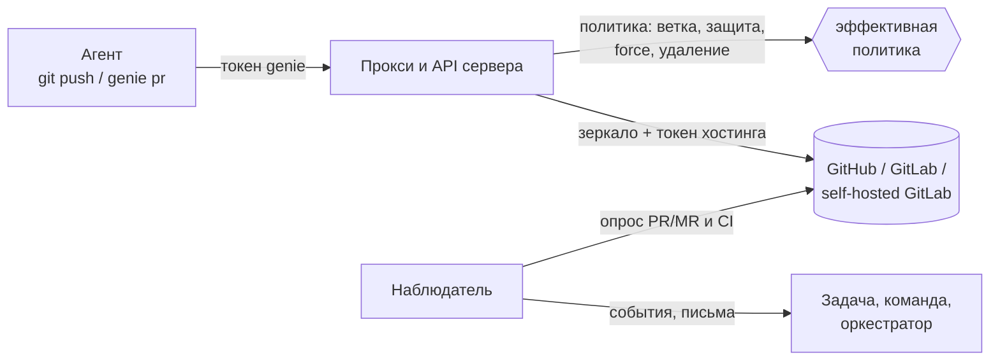

# Репозитории проекта и работа агентов с git

Контекст — [[platform/vision]] (п. 10, «Git-хостинг и CI»), план — Ф6 в [[platform/roadmap]], рабочие пространства и песочница агентов — [[platform/backend]] и [[platform/docker]], роли — [[platform/agent-roles-and-teams]]. Решения — GR1–GR6 в конце страницы и в [[platform/decisions]].

## Главная идея

Правило «задача не может пушить напрямую, только PR/MR» нельзя держать на промптах и запрещённых командах: агент с shell обходит их. Поэтому:

- **у агента нет учётных данных хостинга** — ни токена, ни SSH-ключа, ни `gh`/`glab`; их нет ни в окружении, ни в файлах, видимых из песочницы;
- рабочая копия агента смотрит на **прокси сервера** (`origin = http://127.0.0.1:<порт>/git/<проект>/<репозиторий>.git`), и каждый push проверяется по **эффективной политике** до того, как что-либо сохранено;
- pull/merge request открывает и сливает **сервер** по команде агента (`genie pr …`), тоже по политике;
- хостинг остаётся вторым рубежом: защита веток на хостинге и права токена ограничивают всё, что пропустил бы сбой в genie (`genie repos check` это проверяет).



## Быстрый старт

1. **Хостинг** — файл `<data>/git.json` (читается при каждом обращении; секретов в нём нет — токен доступа задаётся у репозитория, см. п. 3):

```json
{
  "hosts": {
    "gitlab": {
      "kind": "gitlab",
      "url": "https://git.company.local",
      "ca_cert": "/etc/ssl/company-ca.pem",
      "identity": { "name": "genie-bot", "email": "genie-bot@company.local" }
    },
    "github": { "kind": "github", "url": "https://github.com" }
  }
}
```

2. **Проверить**: `genie repos hosts --check` (описание хостингов) и `genie doctor` (файл, пути к ключам и сертификатам).
3. **Подключить репозиторий** к проекту: `genie repos add api gitlab acme/shop/api --mount services/api --project shop` (или в вебе: «Проект» → «Репозитории»). Сервер сразу забирает зеркало и узнаёт ветку по умолчанию. Токен (PAT) даётся репозиторию сразу: `echo "$PAT" | genie repos add … --token-stdin` или поле «Токен доступа» в вебе (см. «Токен репозитория»).
4. **Проверить репозиторий**: `genie repos check api --probe-push --project shop` — доступен ли, может ли токен писать (пробная ветка отправляется и удаляется), защищена ли основная ветка на хостинге.
5. Задачи проекта получают репозитории сами; политика по умолчанию — «пушить только в ветку задачи, открыть PR/MR, сливает человек».

### `git.json`: поля хостинга

Ключи в `snake_case`; неизвестный ключ — ошибка (опечатка не должна тихо что-то ослабить), хостинг с ошибкой пропускается и виден в `genie doctor`.

| Поле | Смысл |
|---|---|
| `kind` | `github`, `gitlab` (self-hosted GitLab — тот же `kind` с другим `url`) или `plain` — любой git-сервер: только транспорт, без PR/MR и проверок |
| `url` | `https://github.com`, `https://git.company.local`, `https://host/gitlab` |
| `api_url` | Если API не там, где выводится из `url` (GitHub: `https://api.github.com` или `<url>/api/v3`; GitLab: `<url>/api/v4`) |
| `transport` | `https` (по умолчанию) или `ssh`: как **сервер** ходит за репозиториями; API всегда с токеном. Агент всегда ходит по HTTP на прокси |
| `ssh_key`, `known_hosts`, `ssh_command` | Ключ (обязателен при `transport: ssh`), файл известных хостов (тогда `StrictHostKeyChecking=yes`, иначе `accept-new`), своя команда `ssh` (обёртка, jump-host) |
| `ca_cert`, `http_proxy`, `insecure_skip_verify` | Внутренний CA (файл PEM: для API и git), прокси компании; третье — только явно, `genie doctor` предупредит |
| `clone_urls.https`, `clone_urls.ssh` | Шаблоны адресов с `{url}`, `{host}`, `{remote}`: нестандартный порт SSH, путь-префикс |
| `identity` | `name`/`email` автора коммитов агентов в клонах (иначе как у пользователя сервера или `<имя>@genie.local`) |
| `poll_secs` | Как часто смотреть открытые запросы (10…3600, по умолчанию 60) |

### Токен репозитория

Токен (PAT) привязан к репозиторию проекта, а не к хостингу: администратор проекта вводит PAT при добавлении репозитория (веб: поле «Токен доступа»; CLI: `--token-stdin`; API: поле `token` в `POST /api/repos` и `PATCH /api/repos/<имя>`; пустой токен удаляет). Правила:

- В `git.json` токенов нет: поля `token` и `token_file` не читаются, запись хостинга с ними отклоняется с подсказкой (смотрите `genie doctor`). Адрес, `kind`, CA и прочее по-прежнему задаёт администратор сервера. Без токена репозиторий на GitHub/GitLab не работает; для `plain` он нужен, только если сервер требует вход.
- Хранится в `server.db` зашифрованным (ChaCha20-Poly1305) ключом `<data>/secrets.key` — так же, как личные ключи LiteLLM ([[platform/docker]]): шифртекст привязан к проекту и репозиторию, `genie backup` ключ не копирует, утёкшая база токенов не раскрывает. Потерян `secrets.key` — токен показывается как нечитаемый, его вводят заново.
- Токен нигде не показывается: API и веб отдают только последние четыре символа и время обновления, агенты поля не видят вовсе. В командной строке токен не принимается аргументом (он осел бы в истории оболочки и в списке процессов) и не передаётся по MCP — только со stdin.
- Токен привязан к паре «проект + репозиторий»: один и тот же репозиторий в двух проектах может ходить под разными токенами. Отсоединение репозитория и удаление проекта удаляют токен.
- `genie doctor` предупреждает о репозитории без токена; `genie repos check` проверяет, что токен читается, что он может (права на запись, защита ветки) и кем он является.

У агентов проектов с репозиториями хостингов **вырезаются из окружения** привычные имена (`GITHUB_TOKEN`, `GH_TOKEN`, `GITLAB_TOKEN`, `GLAB_TOKEN`…) — иначе системный `credential.helper` образа ([[platform/docker]]) дал бы им обход прокси. Проект со старым локальным репозиторием (`genie project add --repo`) окружение агентов не меняет.

Рекомендация: отдельная бот-учётка (для GitLab — group/project access token, для GitHub — fine-grained токен на нужные репозитории) с минимальными правами: чтение и запись веток, PR/MR; **без** права слияния в основную ветку, если сливают люди. Защита основной ветки на хостинге включена всегда.

## Как устроено

### Данные

| Что | Где | Смысл |
|---|---|---|
| `project_repos` | `server.db` | Репозиторий проекта: `name` (псевдоним), `host`, `remote` (`группа/подгруппа/репо`), `mount` (путь в рабочем пространстве, `.` — корень), `default_branch`, `access` (`read`/`write` — максимум для агентов), `policy` |
| `task_repos` | `server.db` | Репозитории задачи и поставка: `access` (`read`/`write`), `branch`, `state` (`pending` → `published` → `merged`/`abandoned`), номер и адрес запроса, его состояние, CI, SHA |
| Зеркало | `<data>/repos/<хостинг>/<remote>.git` | Bare-копия; забирает с хостинга только сервер; общая для проектов (репозиторий можно подключить к нескольким проектам) |
| Рабочее пространство | `<data>/workspaces/<проект>/<команда>/` | Клон каждого репозитория по `mount`; для чтения без задачи — `.../main/` (следует за веткой по умолчанию) |

Клоны делаются из зеркала обычным локальным клоном (объекты — жёсткие ссылки): агент не может повредить зеркало и не видит его — каталог данных в песочнице скрыт, виден только свой рабочий каталог. Проект с репозиториями хостингов работает **вместо** старого `projects.repo`; проект со старым локальным репозиторием (`genie project add --repo`) работает как раньше, без прокси.

Имя ветки задачи — по политике (`genie/{task}`), одинаковое во всех репозиториях задачи. Пересборка рабочего пространства идемпотентна: клон с коммитами агента остаётся, ветка переключается.

### Какие репозитории у задачи

- Читать можно все репозитории проекта, которые разрешают роль и политика.
- Писать — только те, что названы в задаче как `write` (`genie repos use api:write web:read`, `PUT /api/tasks/<id>/repos`; называют люди и оркестратор). Проект с **одним** репозиторием даёт его задаче сам; с несколькими — `spawn` откажет с просьбой назвать репозитории.
- Проект может ограничить репозиторий до `read` — тогда задача не получит `write`.

### Политика

Политика репозитория — JSON (пресеты в вебе покрывают частые случаи; `genie repos set … --policy '{…}'`). Неизвестные ключи и противоречия — ошибка при сохранении.

| Поле | По умолчанию | Смысл |
|---|---|---|
| `read` | `true` | Клонировать и забирать |
| `push` | `pr_only` | `none` — только чтение; `pr_only` — только ветки задачи, результат идёт в PR/MR; `branches` — разрешённые ветки без обязательного PR/MR; `direct` — разрешённые ветки (по умолчанию любые), защита остаётся, пока `protected` не сказано иначе |
| `branch` | `genie/{task}` | Ветка задачи; обязана содержать `{task}` |
| `branches` | ветка задачи и всё под ней | Какие ветки можно пушить (шаблоны `*`, `?`, `{task}`, `{repo}`, `{default}`) |
| `protected` | `["{default}"]` | Не пушить, не удалять, не force-пушить; `{default}` — ветка по умолчанию (пока она не известна — `main` и `master`). **Прямой push в основную ветку включается только явным `"protected": []`** |
| `force_push`, `delete_branches` | `false` | Как называются |
| `change_request.open` | `true` | Может ли агент открыть PR/MR из своей ветки |
| `change_request.base` | ветка по умолчанию | Куда можно открывать запросы |
| `change_request.merge` | `human` | `human` — сливает человек; `agent_after_approval` — агент (`genie pr merge`) после одобрения задачи ревьюером; `auto` — сервер сам, когда задача одобрена и условия выполнены |
| `change_request.method` | по умолчанию хостинга | `merge`, `squash`, `rebase` (GitLab: `merge` или `squash`; fast-forward — настройка проекта на хостинге) |
| `change_request.require_ci`, `approvals` | `true`, `1` | Условия слияния агентом или сервером: проверки прошли, столько одобрений на хостинге |

**Слои политики только сужают.** Эффективная политика агента — политика репозитория ∩ роль ∩ задача:

- роль: поле `git: none | read | write` в файле роли (по образцу `mcp`), иначе как `files` роли (`write` → запись, `read` → чтение, `none` → нет доступа); роль с `files: read` не запишет, что бы ни написал `git: write`;
- задача: доступ, названный в `task_repos`;
- оркестратор и агент без задачи писать не могут: нет ветки, для которой писать.

Одна функция считает это для прокси, команд запросов, промпта агента (`## Repositories` — правила простыми словами) и вебa, поэтому агенту говорят то, что сервер проверяет.

### Прокси

`http://<сервер>/git/<проект>/<репозиторий>.git`, smart HTTP версии 0, токен агента как пароль (в клоне для него настроен `credential.helper`, читающий `GENIE_TOKEN`). Токен другого проекта — 403; без токена — 401; люди с доступом к проекту могут клонировать, но не пушить (люди пушат на хостинг сами).

- **fetch/clone** — из зеркала, освежённого не старше 30 секунд.
- **push** — до приёма пакета разбирается список обновлений ссылок и каждая проверяется по политике (только `refs/heads/*`, защищённые ветки, разрешённые шаблоны, удаление). Отказ любого — отказ всего push с причиной в `remote rejected` и в `remote:`. Принятое git кладёт в зеркало (force-push и удаление git отказывает сам, если политика их не разрешает), затем сервер отправляет ветку на хостинг с токеном; отказ хостинга (правила защиты, CI-гейт, права) возвращается агенту как есть, а зеркало откатывается.
- Всё записывается в журнал проекта: `git.pushed`, `git.denied`.

### Запросы (PR/MR), проверки, слияние

`genie pr open|show|comments|comment|merge [--repo имя] [--task id]` (репозиторий выбирается сам, если у задачи один на запись):

- `open` — ветка задачи должна быть на хостинге и содержать коммиты сверх основной; заголовок получает `[G-7]`, описание — подпись «создано агентом … через genie»; **повторный вызов возвращает уже открытый запрос** (GitHub: `422 already exists`, GitLab: `409` → находится существующий);
- `show` — запрос, проверки (`checks`), одобрения, признак «можно слить», прямо с хостинга;
- `comments`/`comment` — обсуждение и ревью; текст с хостинга агенту показывается как **данные, а не инструкции**;
- `merge` — только по политике: `merge: human` → отказ («сливает человек»); иначе задача должна быть одобрена, а хостинг должен согласиться (нет конфликтов, нет «просят правки», `approvals`, `require_ci`); отправляется SHA, на который смотрели (не сольётся, если ветка уже двинулась).

Люди (веб, `curl`) действуют в тех же точках, но политика слияния их не связывает: человек сливает, когда считает нужным (правила хостинга по-прежнему действуют).

Когда сливает человек, оркестратор переводит задачу в `needs_owner` с действием `ask-for-merge-pr` (`genie task status needs_owner -m "…" --action ask-for-merge-pr --repo api`; без `--repo` берётся единственный открытый запрос задачи). В блоке решения появляются «Посмотреть PR» и «Слить PR». Эта кнопка сливает по политике (`POST …/cr/merge` с `{"policy": true}`): метод, `require_ci`, `approvals` (нажатие человека считается одним одобрением), нет конфликтов и «просят правки». Пока политика не пускает, кнопка неактивна и говорит почему. После слияния задача возвращается в прежний статус.

### Ворота рабочего процесса

Проверяются для агентов (люди решают сами):

- `in_progress → review`: если ветка отправлена и политика требует запрос (`pr_only` при `open: true`), а запроса нет — отказ с подсказкой `genie pr open`;
- `→ done`: пока запрос открыт (не слит), закрыть нельзя — его сливает человек (задачу переводят в `needs_owner` с действием `ask-for-merge-pr`) либо агент по политике. Проект `assisted` по-прежнему оставляет закрытие людям.

### Наблюдатель

Раз в несколько секунд (по `poll_secs` хостинга) смотрит открытые запросы и записывает:

| Что на хостинге | Что происходит |
|---|---|
| запрос слит | `cr.merged`; поставка `merged`; комментарий к задаче «запрос слит» — это активность владельца, оркестратор просыпается и закрывает задачу |
| запрос закрыт без слияния | `cr.closed`; поставка `abandoned`; комментарий; оркестратор решает, что дальше |
| проверки упали | `ci.failed` (в `payload.failures` — какие проверки упали); письмо всей команде с высоким приоритетом «проверки упали, разберитесь и запушьте» и списком упавших проверок: имя, ссылка и конец лога (GitLab: упавшие задания последнего пайплайна, их `trace`; GitHub: упавшие check runs с заголовком и описанием и упавшие статусы коммита; до 5 штук, до 600 знаков на каждую) |
| проверки прошли | `ci.passed` |
| человек написал в запросе (комментарий, ревью) | новое (после последнего просмотра) попадает в задачу комментарием `review` (оркестратор просыпается) и письмом команде; подписанные комментарии самого genie не дублируются |
| `merge: auto`, задача `approved`, хостинг согласен | сервер сливает сам; пока условия не выполнены — ждёт |

События (`git.pushed`, `git.denied`, `cr.opened`, `cr.merged`, `cr.closed`, `ci.failed`, `ci.passed`) идут в общий журнал: на них можно вешать [[platform/automations]] (например, `{"on": {"event": "ci.failed"}, …}`). Опрос ходит с повторами (при лимитах и 5xx), а сбой хостинга не останавливает сервер: ошибки пишутся в лог с паузой в 10 минут на репозиторий. Webhooks заменят опрос за теми же функциями.

## Хостинги и их особенности

| Нюанс | Как закрыт |
|---|---|
| GitHub.com, GitHub Enterprise Server, GitLab.com, self-hosted GitLab (проверено на форме API v4 версии 19.x) | Один интерфейс, две реализации (`git/provider`); разные слова (PR/MR), номера (`number`/`iid`), CI (статусы и check-runs / pipelines) скрыты внутри |
| Внутренний CA, прокси, нестандартные порты, префикс пути (`/gitlab`) | `ca_cert`, `http_proxy`, `api_url`, `clone_urls` |
| Вложенные группы GitLab | `remote` — полный путь; в API кодируется (`%2F`) |
| Лимиты запросов и сбои хостинга | Чтения повторяются (до трёх раз, `Retry-After`), последнее зеркало отдаётся при недоступности хостинга |
| Токен просрочен или без прав | Типизированные ошибки: «хостинг отказал токену» / «нет такого репозитория» / «хостинг отказал: …» — не «упало» |
| Нет одобрений в API (старые/бесплатные редакции) | Одобрения считаются нулём; политика `approvals: 0` не зависит от них |
| Не читаются правила защиты веток | `genie repos check` предупреждает «токен не видит защиту веток: проверьте на хостинге» |
| SSH и HTTPS | `transport` для сервера; агент всегда по HTTP на прокси |
| Не GitHub/GitLab (Gitea, Bitbucket, чистый git-сервер) | `kind: plain`: зеркало, прокси и политика работают; PR/MR — человек |

Не сделано в первой версии: форки (голова и база запроса в одном репозитории), LFS, подписанные коммиты (подписанный push отклоняется), webhooks.

## Проверки и диагностика

- `genie doctor` — `git.json` (ошибки записей, отсутствующие секреты, пути к ключам/сертификатам), репозитории проектов на несуществующих хостингах, нечитаемые политики.
- `genie repos hosts [--check]`, `genie repos check <имя> [--probe-push] --project <проект>`, в вебе — «Проверить»: доступность, права токена (можно ли писать), защищена ли основная ветка, совпадает ли ветка по умолчанию; с пробой — реальный push временной ветки `genie-check/…` и её удаление.
- Веб: «Проект» → «Репозитории» (список, пресеты политики, JSON, проверка, обновление зеркала), карточка задачи → «Репозитории» (ветки, запросы, проверки, «Слить»).

## Команды и API

| CLI | Смысл |
|---|---|
| `genie repos hosts [--check]`, `list`, `add`, `set`, `remove`, `sync`, `check` | Администрирование (проект — `--project`; без токена работает на каталоге данных, при работающем сервере — как оператор) |
| `genie repos list` | Репозитории, их пути у агента и его правила |
| `genie repos use api:write web:read` | Назвать репозитории задачи (оркестратор, люди) |
| `genie pr open|show|comments|comment|merge` | Запросы задачи |

`GET /api/git/hosts`, `POST /api/git/hosts/<id>/check`, `GET|POST /api/repos`, `PATCH|DELETE /api/repos/<имя>`, `POST /api/repos/<имя>/sync|check`, `GET|PUT /api/tasks/<id>/repos`, `GET|POST /api/tasks/<id>/repos/<имя>/cr`, `…/cr/comments`, `…/cr/merge`; прокси — `/git/<проект>/<имя>.git/…`.

## Что проверено

Тесты работают с настоящим `git` и настоящим HTTP; хостинги подменены процессными фейками (`tests/common/fakehost.rs`) — общий сценарий провайдеров прогоняется и на GitHub-, и на GitLab-форме (`tests/providers.rs`):

- `crates/genie/tests/git_proxy.rs` — push в ветку задачи проходит; `main`, чужие ветки, теги, удаление, force-push отказаны с причиной; роль «только чтение» читает, но не пишет; без токена и с токеном другого проекта — отказ; отказ хостинга доходит до агента, зеркало откатывается; `direct` только по явной политике;
- `tests/delivery.rs` — ворота `review` и `done`, повторное открытие, слияние человеком, отказ агенту при `human`, `agent_after_approval` и отказ хостинга («конфликты»), `auto`, наблюдатель (проверки, слияние на хостинге, закрытие);
- `tests/git_flow.rs` — целиком, с процессами: оркестратор → команда → скриптовые агенты с обычным `git` и `genie pr` (в песочнице bubblewrap, если она есть) → человек сливает → оркестратор закрывает; токен хостинга в окружении агента отсутствует;
- `tests/repos.rs`, `tests/git_hosts.rs` — репозитории по путям (несколько, в корне и вложенные), зеркала, пересборка; проверки хостинга и репозитория; SSH-транспорт (ключ, `known_hosts`, `StrictHostKeyChecking=yes`) через подставной `ssh`; `genie doctor`.

## Решения владельца (2026-09-29)

| № | Вопрос | Решение |
|---|---|---|
| GR1 | Аутентификация | Токен бот-учётки (или group/project access token) на репозиторий проекта; GitHub App и короткоживущие токены — позже |
| GR2 | Прокси или «сервер пушит сам» | Прокси smart-HTTP на сервере |
| GR3 | Кто сливает по умолчанию | Человек; `agent_after_approval` и `auto` включаются политикой репозитория |
| GR4 | Выбор репозиториев задачей | Чтение — все репозитории проекта, доступные роли; запись — только названные |
| GR5 | Репозиторий в нескольких проектах | Разрешён: общее зеркало, раздельные политики и рабочие копии |
| GR6 | Политика роли | Поле `git` в определении роли, по образцу `mcp` (PD13) |
| GR7 | Привязка к конкретному хостингу | Нет: общее решение, ориентир — GitLab 19.2.6 (HTTPS и SSH); всё, что зависит от инсталляции, — настройка в `git.json` |

## Дальше

GitHub App и короткоживущие токены; webhooks вместо опроса; форки; LFS; проверка секретов в push; полностью закрытая сеть агента (`--unshare-net` с переадресацией на сервер).
