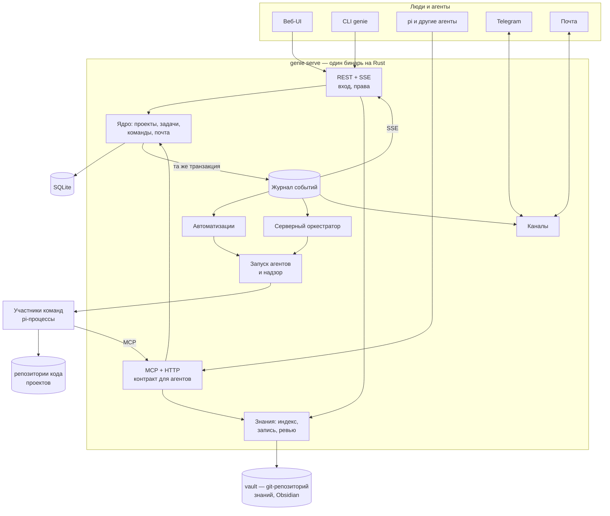

# Genie как платформа — видение и целевая архитектура

Страницы темы: [[platform/decisions|решения]] · [[platform/backend|бэкенд на Rust]] · [[platform/knowledge-vault|хранилище знаний]] · [[platform/automations|автоматизации]] · [[platform/agent-roles-and-teams|роли и шаблоны команд]] · [[platform/roadmap|дорожная карта]].

## Цель

Genie — рабочее пространство небольшой команды (2–15 человек), где **люди и агенты работают над одними задачами**:

- задачи, эпики, доска, прогресс и история — вместо Jira;
- живая база знаний: продукт, архитектура, решения, процессы, глоссарий, чейнджлог — вместо Confluence;
- агенты запускаются **сами** — по событиям, расписанию и входящим сообщениям, а не только когда владелец сидит в своей сессии pi;
- над проектами работают несколько людей с разными ролями; каждый видит своё и получает уведомления туда, где ему удобно (веб, Telegram, почта).

Критерий успеха: команда из 3–5 человек месяц ведёт реальный продукт в genie, ни разу не открыв Jira и Confluence, и заметная часть работы начинается автоматизациями, а не руками.

## Рамки

Приняты владельцем 2026-09-28, подробно — [[platform/decisions]]:

- одна инсталляция на команду, без мультиарендности;
- на время тестирования всё разворачивается на локальной машине; контейнеры и облако компании — отдельный этап;
- знания хранятся не в репозитории кода, а в отдельном Obsidian-совместимом хранилище (vault — отдельный git-репозиторий);
- агенты публикуют документацию по политике раздела;
- каналы MVP — Telegram и почта;
- проекты без кода поддерживаются с первой версии;
- расходы на модели ограничивает корпоративный провайдер; с 2026-10-03 genie их считает и держит бюджеты (PD7 пересмотрено);
- бэкенд — на Rust, ядро переносится до новых возможностей (см. [[platform/backend]]);
- подключение через pi и других агентов прорабатывается отдельно.

## Где мы сейчас

Что уже есть и остаётся фундаментом:

| Есть | Почему это ценно для платформы |
|---|---|
| Трекер со стейт-машиной, ролевыми правами, DoR/DoD, эпиками, артефактами, историей | Процесс зашит в код, поэтому автоматизации могут опираться на него, а не на договорённости в промптах |
| Фокус-команды: роли, модель на роль, worktree на команду, прямая почта, пульс и восстановление | Готовый исполнитель для любых агентных задач, запущенных триггером |
| Веб-интерфейс: доска, эпики, карточка задачи, чат команды, входящие, ⌘K, docs | Основа командного UI; SPA сохраняется при переносе бэкенда |
| Docs-система: Markdown, frontmatter, FTS5, wiki-ссылки, бэклинки, `paths` + `verified` → «возможно устарела» | Ядро базы знаний; синтаксис ссылок уже совместим с Obsidian |
| Дайджест почты для оркестратора, уровни и намерения писем | Модель «агент просыпается от сводки, а не от потока» — то, что нужно серверному оркестратору |

Что мешает стать сервисом:

| Ограничение | Где | Следствие |
|---|---|---|
| Оркестратор — интерактивная сессия pi владельца | `src/extension/index.ts` | Без открытого терминала ничего не движется; headless-команды завершаются вместе с сессией |
| Каждый процесс (pi-участник, CLI, веб) пишет в SQLite сам | `src/tracker/store.ts`, `src/team/bus.ts` | Права ролей проверяются в каждом клиенте, роль агента задаётся переменной окружения; нет единой точки для событий, авторизации и аудита |
| События трекера — только слушатели внутри процесса и только `status` | `Tracker.onEvent` | Другой процесс не может надёжно реагировать на изменения; SSE в вебе опрашивает `PRAGMA data_version` |
| Один человек: роль `human`, автор из `tailscale whois` | `src/tracker/model.ts`, `src/web/server.ts` | Нет пользователей, прав, назначения на людей, подписок, личных уведомлений |
| Нет аутентификации, сервер слушает 127.0.0.1 и tailnet | `src/web/server.ts` | Коллеге или менеджеру доступ не дать |
| Уведомления — `notify-send` и herdr | `src/notify.ts` | Только рабочий стол владельца |
| Трекер привязан к репозиторию (`.genie/` в главном worktree), docs — к `docs/` репозитория | `src/tracker/fsutil.ts`, `src/docs/root.ts` | Нет понятия «проекты команды», нет проектов без кода, знания смешаны с кодом |

## Целевая картина



Ключевой сдвиг: **сервер — единственный владелец данных.** Все клиенты — веб, CLI, участники команд, личные агенты людей, каналы — работают через его API. Всё, что система делает сама (оркестратор, автоматизации, уведомления), — подписчики журнала событий. Человек в терминале перестаёт быть обязательным звеном.

### 1. Журнал событий

Каждое изменение (задача, статус, поле, комментарий, артефакт, критерий, команда, письмо, страница знаний) в **той же транзакции** добавляет строку в журнал:

```
events(id INTEGER PK, at, project, type, subject, actor, actor_kind, cause, payload JSON)
```

- Типы: `task.created`, `task.updated`, `task.status_changed`, `task.commented`, `task.artifact_added`, `task.criterion_checked`, `task.assigned`, `task.needs_owner`, `epic.progress`, `team.spawned`, `team.member_lost`, `team.stopped`, `mail.sent`, `doc.changed`, `doc.stale`, `doc.proposal`, `channel.message_received`, `schedule.tick`, `webhook.received`, `automation.run_finished`.
- Подписчики (веб-SSE, автоматизации, оркестратор, каналы, исходящие webhooks) хранят **курсор** и читают «от курсора»: событие не теряется при падении и обрабатывается одним подписчиком ровно один раз.
- Веб получает не «что-то изменилось», а что именно, и обновляет только затронутые данные.

### 2. Сервер `genie serve`

- Один бинарь на Rust: API, веб (SPA встроена), MCP, фоновые подписчики, запуск агентов; CLI `genie` — тот же бинарь. Устройство и перенос — [[platform/backend]].
- Локально: `genie serve` на localhost, каталог данных, конфиг в нынешнем формате `config/default.json`. Для агентов рядом установлен pi.
- Всё MVP работает без публичного адреса: Telegram — long polling, почта — SMTP и IMAP, веб — localhost или tailnet.
- Резервные копии: регулярные снапшоты SQLite и git-ремоуты для vault и кода.
- Контейнеры, облако компании и корпоративный SSO — отдельный этап (Ф7 в [[platform/roadmap]]).

### 3. Проекты

- Проект = трекер задач со своим префиксом ID (`G-`, `PAY-`…) + пространство в vault + необязательный репозиторий кода.
- **С кодом**: команды получают worktree, `paths` страниц знаний связаны с кодом проекта, позже — PR и CI.
- **Без кода** (продукт, аналитика, исследования, процессы): команды работают без worktree, как шаблоны `research` и `spike` сейчас; результат — артефакты задач и страницы vault.

### 4. Люди, роли, права

| Роль в проекте | Может |
|---|---|
| owner | всё, включая автоматизации, секреты и участников |
| admin | всё, кроме удаления проекта и секретов |
| member | задачи, комментарии, доска, знания, запуск команд |
| viewer / guest | чтение (guest — только открытые ему эпики и пространства), комментарии по настройке |

- `Actor` получает id пользователя вместо общего `human`; роль `human` остаётся классом для правил стейт-машины, права проекта проверяются слоем выше.
- Задачу можно назначить **человеку** (ревью, решение, ручной шаг); появляются наблюдатели, упоминания `@имя`, лента активности, «Мои задачи», «Ждут меня»; `needs_owner` — «нужно решение от …» с конкретным адресатом.
- Вход на этапе локального тестирования: локальные учётки и приглашения, magic link при настроенном SMTP; корпоративный SSO — вместе с переходом в облако. Telegram привязывается одноразовым кодом из профиля.
- Агенты — отдельные субъекты с токенами, привязанными к проекту, команде и роли; права проверяет сервер, поэтому «мягкие» права ролей из [[architecture]] становятся жёсткими.

### 5. Серверный оркестратор

Оркестратор перестаёт быть длинным чатом в терминале и становится **агентом, которого будят события**:

- подписан на журнал: новые задачи во входящих, письма команд (через нынешний дайджест), ответы людей, снятые `needs_owner`, потерянные участники;
- каждое пробуждение — короткий ход с дайджестом и снимком состояния из трекера; память — в трекере, а не в контексте;
- **аренда**: в проекте активен один оркестратор; сессия pi человека может «взять пульт», тогда серверный оркестратор ждёт, пока пульт не отпустят;
- уровни автономности проекта: `manual` (только предлагает), `assisted` (берёт в работу, закрывает с подтверждением), `autonomous` (как сейчас).

### 6. Автоматизации

Правила «**когда** событие и фильтр → **если** условие → **сделать** шаги» с долговечными запусками, идемпотентностью, защитой от каскадов и журналом запусков. Шаги — детерминированные действия, разовые агентные задания и ожидание ответа человека. Подробно — [[platform/automations]].

Оркестратор и автоматизации не конкурируют: автоматизации ведут предсказуемые конвейеры («задача закрыта → знания + чейнджлог + уведомление»), оркестратор принимает решения («что делать с этой задачей»). Автоматизация может разбудить оркестратора, оркестратор — запустить автоматизацию.

### 7. Каналы: Telegram и почта

- **Telegram-бот**: личные сообщения и чат проекта, кнопки (одобрить, отклонить, открыть в вебе); ответ на сообщение бота привязывается к задаче или вопросу и приходит событием `channel.message_received`. Long polling работает без публичного адреса.
- **Почта**: исходящая через SMTP, входящая через IMAP; тред задачи узнаётся по токену в `Reply-To`.
- **Веб**: центр уведомлений.
- **Опросник** — вопросы агента конкретному человеку с каналом, сроком и статусом ответа по каждому вопросу; ответы сохраняются в задаче и будят того, кто спрашивал.
- Входящий текст из каналов — **недоверенные данные**: агент получает его как цитату с пометкой источника, а не как инструкцию; действия с правами, секретами и удалением из каналов недоступны.
- Slack, Mattermost и прочее — после MVP, через исходящие webhooks.

### 8. Знания в vault

Знания живут в отдельном git-репозитории в формате Obsidian: пространства проектов и общие разделы, политики публикации `direct` / `review` / `locked`, ревью изменений агентов внутри genie, связь страниц с задачами и кодом, чейнджлог проекта и действие «Релиз». Правки из Obsidian приходят через git. Подробно — [[platform/knowledge-vault]].

### 9. Исполнение агентов

- Адаптер `AgentRuntime`: сначала pi (панели herdr или headless `pi --mode rpc`), как сейчас; другие харнессы — отдельная тема ([[platform/backend#Подключение агентов — отдельная тема]]).
- Агенты ходят к серверу по MCP/HTTP со своим токеном, а не в SQLite напрямую через `GENIE_DIR`.
- Лимиты — на поведение: параллельные команды и участники на проект и сервер, очередь вместо отказа.
- Расходы genie не считает и не ограничивает. Если провайдер принимает метки запроса, genie передаёт проект, задачу, роль и правило автоматизации, чтобы расход раскладывался по задачам в отчётах провайдера.
- Контейнер на команду и удалённые раннеры — на этапе контейнеров и облака.

### 10. Git-хостинг и CI (после MVP)

Интеграция с git-хостингом компании: PR/MR из ветки команды на `review`, merge по `mergeStrategy` на `done`, события PR и CI в журнал. `ci.failed` на ветке команды будит исполнителя, ревью человека в PR становится комментарием `review` в задаче.

## Что сознательно не делаем

- Не копируем Jira целиком: никаких настраиваемых схем workflow, экранов и полей. Статусы и роли — зашитый процесс genie, гибкость — в автоматизациях.
- Не пишем свой вики-движок с блочным редактором: Markdown, Obsidian на десктопе и редактор с предпросмотром в вебе.
- Не делаем бюджеты, биллинг и мультиарендность.
- Не делаем тайм-трекинг, спринты со story points и отчёты «для менеджмента» в первой версии; прогресс считается по статусам и эпикам.
- Не держим копию задач в Telegram: канал — это уведомления и ответы, а данные живут в трекере.

## Риски

| Риск | Мера |
|---|---|
| Перенос на Rust надолго откладывает новые возможности | Перенос по частям, с тестами как спецификацией; TS-версия остаётся рабочей до переключения; новые возможности сразу на Rust, чтобы не делать их дважды |
| Поведение новой реализации расходится со старой | Тесты переносятся раньше кода; e2e-сценарии `scripts/e2e*.ts` прогоняются на Rust-сервере до переключения |
| Конфликты правок vault из Obsidian, веба и от агентов | Веб и агенты пишут только через сервер; правки из Obsidian приходят через git; пересекающиеся правки не перезаписываются, а превращаются в уведомление владельцу раздела |
| Каскады правил (правило A порождает событие для правила B …) | Причинная цепочка в событии, лимит глубины (по умолчанию 3), запрет самотриггера, журнал запусков |
| Зацикленные и зависшие агентные задания | Таймауты, лимиты параллельности и запусков в час, кнопка остановки; деньги при этом ограничивает провайдер |
| Prompt injection из каналов и webhooks | Входящий текст — недоверенные данные с пометкой источника; опасные действия из внешних триггеров недоступны; подтверждение человеком для рискованных шагов |
| Спам уведомлениями | Настройки на пользователя, дайджесты, тихие часы, дедупликация по задаче |
| Потеря данных на локальной машине | Снапшоты SQLite по расписанию, ремоуты для vault и кода |
| Разрастание объёма работ | Фазы с проверяемым результатом ([[platform/roadmap]]); каждая полезна сама по себе |
